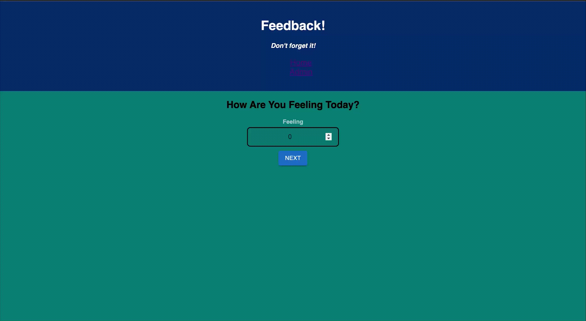

  

# REDUX FEEDBACK

## Description

_Duration: 6 Hours_

This application is a form that collects daily feedback from a user. It has the ability to go back pages to edit your feedback before submission. It also features an Admin Dashboard page where you can see all of the past feedbacks that have been submitted. On the admin page you can also delete past feedbacks.

## Screen Shot

### Prerequisites

1. Node.js
2. Express.js
3. PG
4. Redux
5. React
6. Postgres
7. MUI

## How does someone use this application?

1. Install necessary dependencies by opening the terminal and running 'npm install'
2. Create a database named 'prime_feedback'
3. Import the data SQL file
4. Open 2 terminals.
5. In the first terminal run npm run server
6. In the second terminal run npm run client

## Built With

React, Javascript, Node.js, Express.js, Material-UI, PostgreSQL, Axios, Redux, MUI

## Acknowledgement

Thanks to [Prime Digital Academy](www.primeacademy.io) who equipped and helped me to make this application a reality. Thank you to my instructor Liz when helped answer any questions I may have had while building this!

## Support

If you have suggestions or issues, please email me at [buckhananstephon@gmail.com](https://www.google.com)
